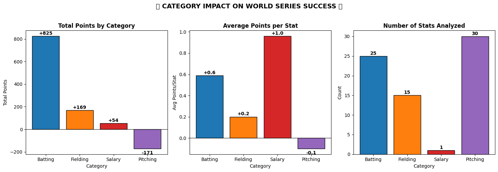
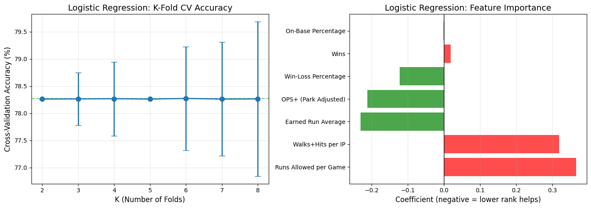

# Postseason Performance Predictor

Welcome to the **Postseason Performance Predictor** project—a data science initiative aimed at exploring and analyzing baseball statistics to uncover meaningful insights about players, teams, and historical trends. This repository showcases our analysis pipeline, including data preprocessing, applied methodologies, and key findings documented in the `Project_Documentation.ipynb` notebook.

## Project Purpose
The primary goal of this project is to leverage advanced statistical techniques and machine learning models to evaluate baseball performance metrics. By analyzing historical data from key datasets, this project uncovers patterns and makes predictions that could aid stakeholders like analysts, coaches, and enthusiasts.

---

## Datasets Used
This project utilizes several datasets rich in player and team statistics. Key datasets include:
- **Historical Player Statistics**: Data encompassing batting averages, home runs, pitching stats, and more.
- **Team Performance Metrics**: Aggregated team-level statistics over various seasons.
- **External Factors** (if applicable): Weather data, league rules, etc., that may influence game outcomes.

---

## Challenges and Solutions
Data preprocessing was a critical part of this project and was tackled in two main phases:

### Phase 1: Data Cleaning
Challenges:
- Inconsistent data formats across datasets.
- Missing values in key performance metrics.

Solutions:
- Unified datasets through standardizing formats (e.g., date, numeric fields).
- Employed strategies such as mean imputation and data interpolation to fill missing values.

### Phase 2: Data Integration
Challenges:
- Merging datasets with varying granularities (e.g., player-level vs. team-level).
- Aligning datasets over a common timeline.

Solutions:
- Used advanced merging techniques with priority for primary keys.
- Developed a custom script to align timeframes and standardize data sampling rates.

---

## Methodology
The analysis is driven by multiple statistical and machine learning approaches, including:
1. **Exploratory Data Analysis (EDA)**: Uncovered patterns, trends, and anomalies in the data.
2. **Predictive Modeling**: Built machine learning models (e.g., regression, classification) to predict and evaluate outcomes.
3. **Feature Engineering**: Created derived metrics to better capture the nuances of baseball performance.
4. **Validation**: Employed techniques like cross-validation to ensure robustness of findings.

---

## 🏆 Key Findings: Predictive Statistics for Pennant Winners
Based on our exploratory data analysis and predictive modeling, we identified the key statistical thresholds required for a team to secure a pennant. Interestingly, pitching and run prevention hold stricter thresholds for success than pure batting metrics.

| Statistic | Category | Importance & Findings |
| :--- | :--- | :--- |
| **Wins / Win-Loss %** | Team Record | **Highest** - No pennant winner has ever ranked below 13th in the league. |
| **ERA / WHIP** | Pitching | **High** - Elite pitching is heavily required; no pennant winner ranked worse than 11th-12th. |
| **OBP** | Batting | **Moderate** - Strong positive correlation (Linear regression weight = +0.066). |
| **RA/G** | Defense | **Moderate** - Displays strong threshold requirements for postseason advancement. |
| **OPS+** | Batting | **Lower** - More forgiving thresholds (teams ranking as low as 24th have won pennants). |

### Visualizing the Impact

*Figure 1: Category Impact on World Series Success. Batting contributes the highest total points, but Pitching imposes the strictest average threshold.*

*Figure 2: Logistic Regression showing K-Fold CV Accuracy and Feature Importance, highlighting the heavy weight of pitching metrics like ERA.*

For a detailed walkthrough of the project, including code and outputs, refer to the `Project_Documentation.ipynb` file in this repository.

---

Thank you for exploring the **Postseason Performance Predictor** project! We welcome contributions, questions, and feedback. Feel free to open an issue or submit a pull request.
